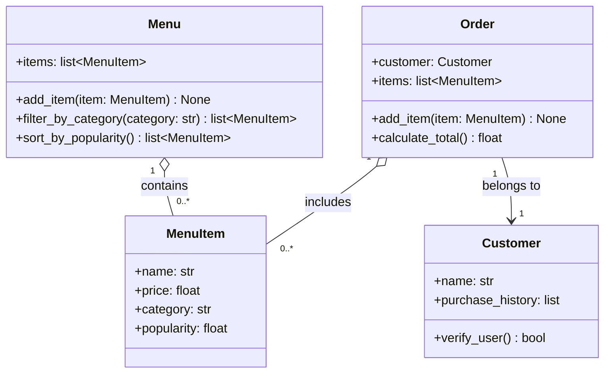

```mermaid
classDiagram
    class Customer {
        +name: str
        +purchase_history: list
        +verify_user() bool
    }

    class MenuItem {
        +name: str
        +price: float
        +category: str
        +popularity: float
    }

    class Menu {
        +items: list~MenuItem~
        +add_item(item: MenuItem) None
        +filter_by_category(category: str) list~MenuItem~
        +sort_by_popularity() list~MenuItem~
    }

    class Order {
        +customer: Customer
        +items: list~MenuItem~
        +add_item(item: MenuItem) None
        +calculate_total() float
    }

    Menu "1" o-- "0..*" MenuItem : contains
    Order "1" --> "1" Customer : belongs to
    Order "1" o-- "0..*" MenuItem : includes
```